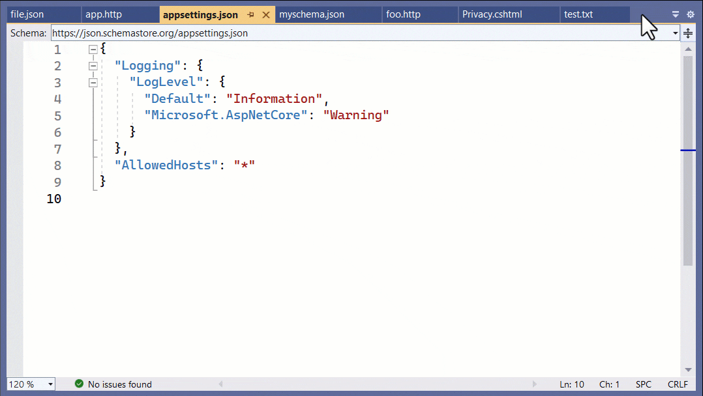

[marketplace]: https://marketplace.visualstudio.com/items?itemName=MadsKristensen.ScrollTabs
[vsixgallery]: http://vsixgallery.com/extension/ScrollTabs.866e1c86-a800-4ca9-9da3-425e0d881b1d/
[repo]:https://github.com/madskristensen/ScrollTabs

# Scroll Tabs for Visual Studio

Download this extension from the [Visual Studio Marketplace][marketplace]
or get the [CI build][vsixgallery].

--------------------------------------

When the mouse hovers over the document tabs and the mouse wheel is scrolled, the multi-line tabs feature is
being toggled on and off as shown in this animation.

This behavior gives you quick access to all your open documents by using the mouse wheel.

You can also move between open documents by holding the **Alt** key while scrolling the mouse wheel.
Scrolling down will activate the document to the right of hte currently open document and vice versa.

## How can I help?
If you enjoy using the extension, please give it a ★★★★★ rating on the [Visual Studio Marketplace][marketplace].

Should you encounter bugs or if you have feature requests, head on over to the [GitHub repo][repo] to open an issue if one doesn't already exist.

Pull requests are also very welcome, since I can't always get around to fixing all bugs myself. This is a personal passion project, so my time is limited.

Another way to help out is to [sponsor me on GitHub](https://github.com/sponsors/madskristensen).
